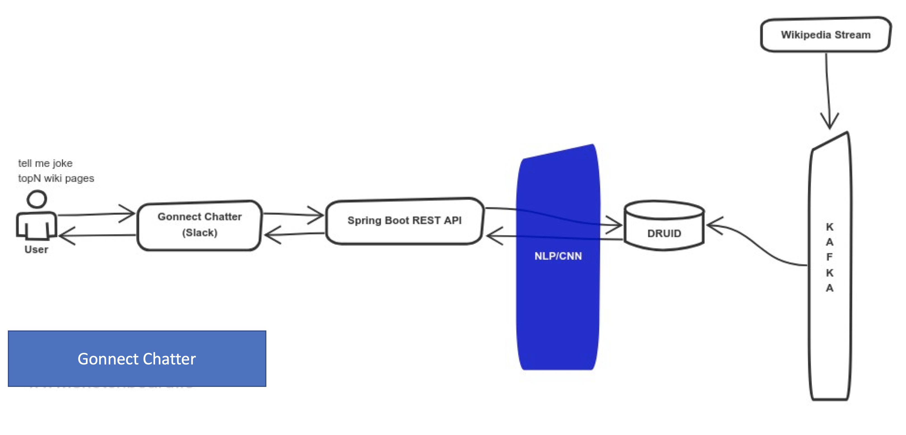
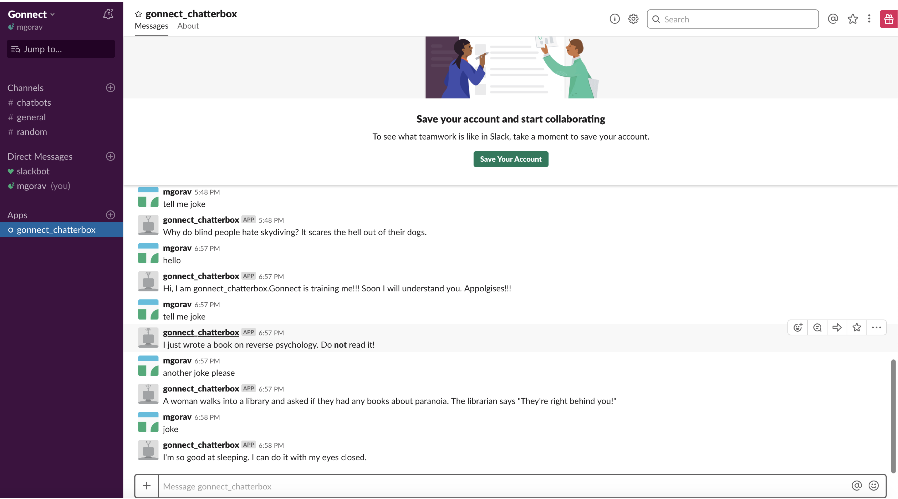

# Gonnect Chatter

 This is the world of business process automation. There are many ways to achieve business automation. One of the way to achieve a business process automation is by creating a chat bot, which learn's using NLP/CNN. Some of use cases where bots can be used are:
  1. HR business process automation
  2. Banking Payment interaction automation
  3. Health Insurance claim adjudication process automation etc etc. 
  
  These chat bots performs best if they are treated like a normal asset of a company. What does this means? I mean, give them the power of data along with deep learning to perform thier duties. How hard it can be to build such architecture & for these bots. 
  
  Check out my github chat bot project, which does the following:
 1. Tells you a joke
 2. Give TopN wikipedia pages use real time streaming
 
 This chat bot is build using:
 1. Spring Boot
 2. Slack
 3. Kafka
 4. Druid
 5. Docker
 
 To summarize:
 
 Chat bot = Conversation AI = NLP + CNN + REST API
 
 NOTE: To keep things simple, a basic text recognition is build
 
 Below picture shows a sample reference architecture of chat bot:
 
 
   
 NOTE: Add token to your slack bot in application.properties file.
 
 After running the Spring Boot application, you chat with Gonnect chatter box as shown below:
 
 
 
 

 Enter into the fascinating world of chatbot :-) This is fun!!! The most important demands from a chatbot are:
 
 1. how fast it can respond real-time to a question
 2. learn equally fast
 3. Integrate seamlessly with business 
 
 In the GitHub chatbot example speed is achieved by Kafka and Druid (indexing key dependent variables from the live stream). The last and not the least, a chatbot learns using NLP/CNN. The reference architecture also utilises RESTful APIs interaction, hence ease of integration with bot. To increase day one conversation with chatterbox, it will scan your API gateway (swagger definition) and derive business intent (using DiagFlow) 
 
 Reiterate: treat chatbot like an employee, give them power of data (datalake), APIs and CNN... they will do wonders!
 
 Note: Just add a slack token in the application.properties file to make Gonnect Chatterbox alive.